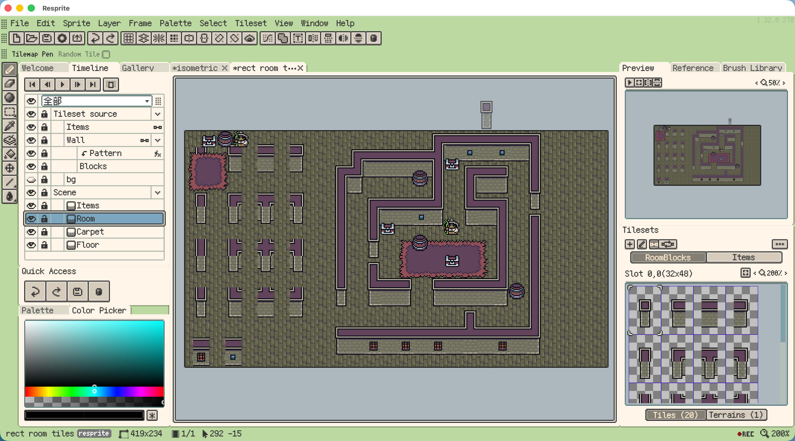
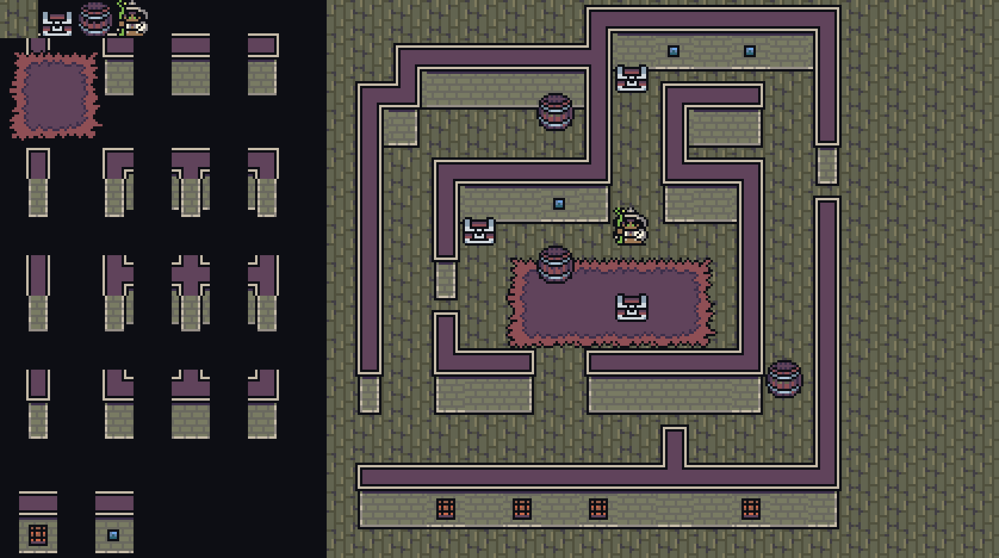
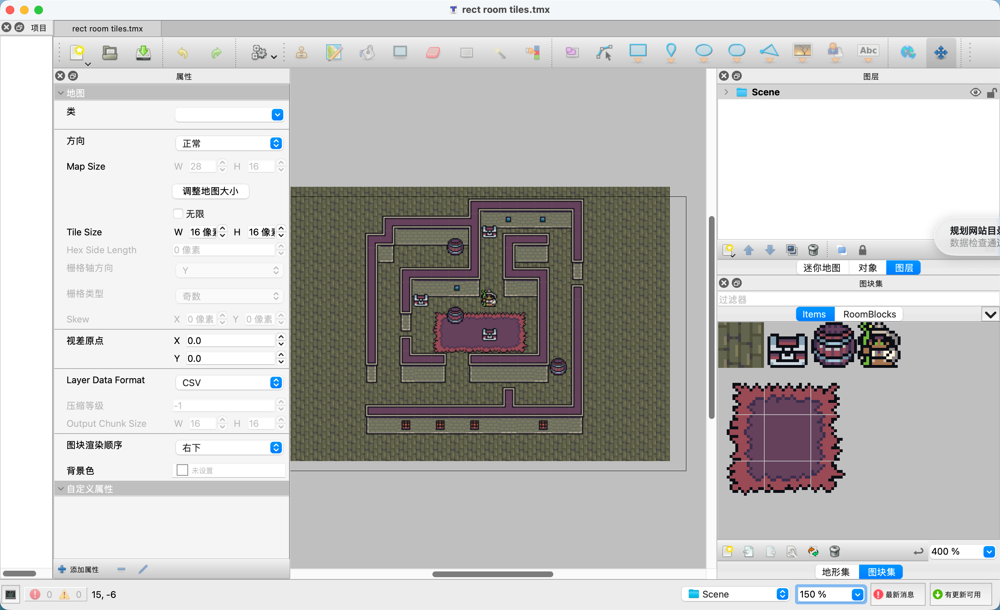

# Rect Room Tiles

A room scene built with **Tilemap Layers** in Resprite. The project includes layered source artwork, separate room and item tilesets, and a **Tiled** export.

## Preview

View the scene and Tiled export

**Scene**

**Tiled**

## Project Files

- [Resprite project](rect_room_tiles.resprite) — Open in Resprite to edit the source artwork and tilemap layers.
- [Room blocks tileset image](tilesets/RoomBlocks.png)
- [Items tileset image](tilesets/Items-tileset.png)

## Tiled Export

- [Tiled map](tiled/rect_room_tiles.tmx) — Open in Tiled to explore the exported scene.
- [Room blocks tileset definition](tiled/tilesets/RoomBlocks.tsx)
- [Items tileset definition](tiled/tilesets/Items.tsx)

Keep the `tiled/` directory together when using the export. The map and tileset definitions reference the images in `tiled/images/` through relative paths.

## Learn More

- [Official documentation: Tilesets and Tilemaps](https://resprite.fengeon.com/docs/drawing/tilemaps-and-tilesets)
- [Official documentation: Tiled Map Compatibility](https://resprite.fengeon.com/docs/files/tiled)

## License

The artwork and example files are released under **CC0 1.0**. You may use, edit, and include them in your own projects without attribution.
