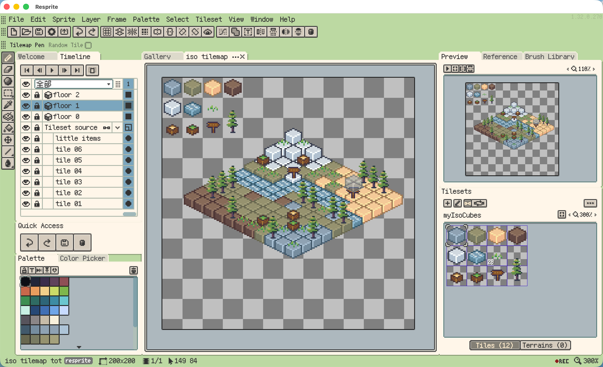
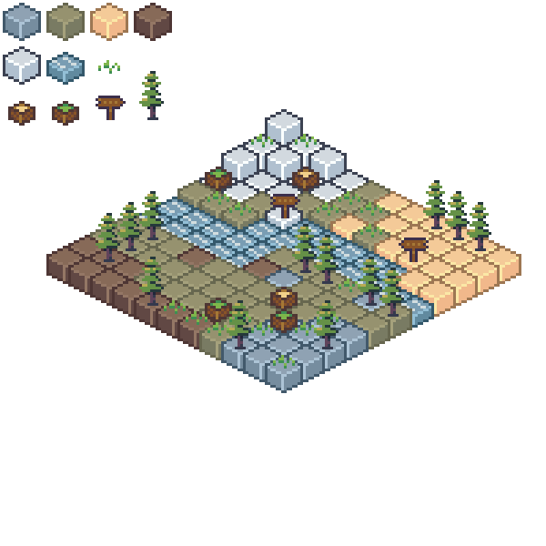
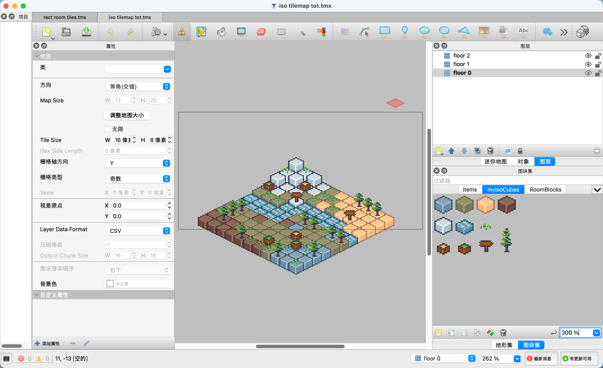

# Tiny Isometric Scene

A small isometric scene built with **Tilemap Layers** in Resprite. Explore the editable tileset source layers, reuse the `.restile` tileset package, or open the exported scene in **Tiled**.

## Preview

View the scene and Tiled export

**Scene**

**Tiled**

## Project Files

- [Resprite project](tiny_isometric_scene.resprite) — Open in Resprite to edit the tileset source layers and isometric tilemap.
- [Resprite tileset package](tilesets/myIsoCubes.restile) — Import into Resprite to reuse the tileset in another document.
- [Tileset image](tilesets/myIsoCubes.png)

## Tiled Export

- [Tiled map](tiled/tiny_isometric_scene.tmx) — Open in Tiled to explore the exported scene.
- [Tileset definition](tiled/tilesets/myIsoCubes.tsx)

Keep the `tiled/` directory together when using the export. The map and tileset definition reference the image in `tiled/images/` through relative paths.

## Learn More

- [Official documentation: Tilesets and Tilemaps](https://resprite.fengeon.com/docs/drawing/tilemaps-and-tilesets)
- [Official documentation: Tiled Map Compatibility](https://resprite.fengeon.com/docs/files/tiled)
- [Watch the isometric scene timelapse on YouTube](https://www.youtube.com/watch?v=AtCcPIUafWs)

## License

The artwork and example files are released under **CC0 1.0**. You may use, edit, and include them in your own projects without attribution.
