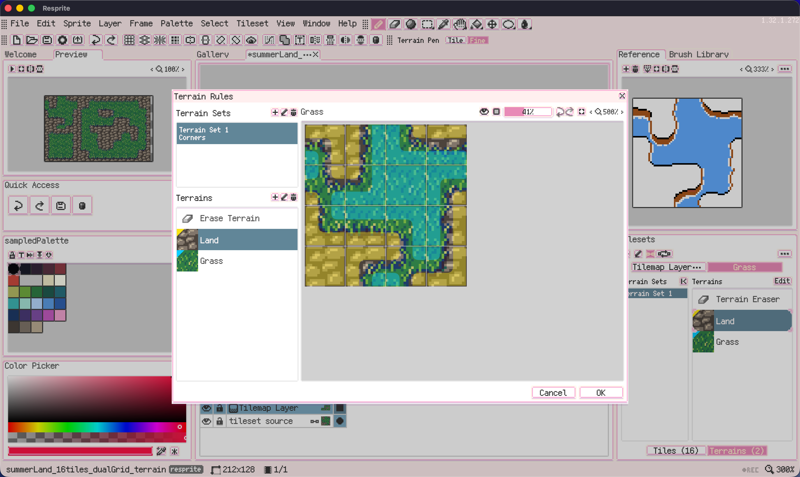
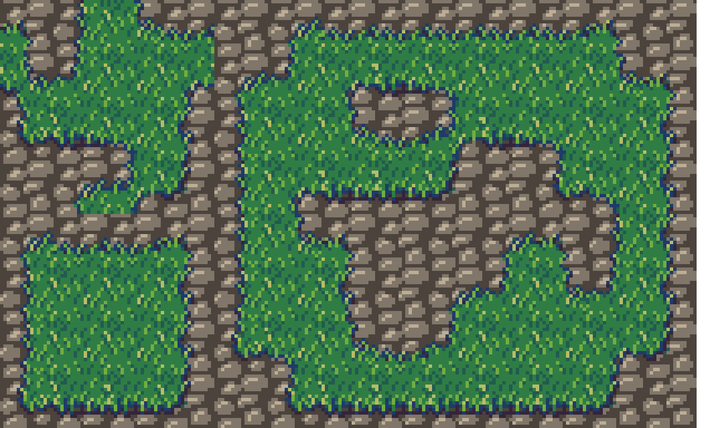

# Summer Land Dual-grid Terrain

A grassland tilemap demonstrating a **16-tile dual-grid tileset** and **Terrain Rules** in Resprite. The project includes a reusable `.restile` tileset package and a **Tiled** export.

## Preview

View the finished tilemap

## Project Files

- [Resprite project](summer_land_dual_grid_terrain.resprite) — Open in Resprite to inspect the terrain rules and continue terrain painting.
- [Resprite tileset package](tilesets/Grass16tiles.restile) — Import into Resprite to reuse the tileset in another document.
- [Tileset image](tilesets/Grass16tiles.png)

## Tiled Export

- [Tiled map](tiled/summer_land_dual_grid_terrain.tmx) — Open in Tiled to explore the exported scene.
- [Tileset definition](tiled/tilesets/Grass16tiles.tsx)

Keep the `tiled/` directory together when using the export. The map and tileset definition reference the image in `tiled/images/` through relative paths.

## Learn More

- [Official documentation: Tilesets and Tilemaps](https://resprite.fengeon.com/docs/drawing/tilemaps-and-tilesets)
- [Official documentation: Terrain Rules and Terrain Painting](https://resprite.fengeon.com/docs/drawing/terrain-rules)
- [Official documentation: Tiled Map Compatibility](https://resprite.fengeon.com/docs/files/tiled)
- [Watch the dual-grid terrain tutorial on YouTube](https://www.youtube.com/watch?v=t7kwwRMuRgE)

## License

The artwork and example files are released under **CC0 1.0**. You may use, edit, and include them in your own projects without attribution.
