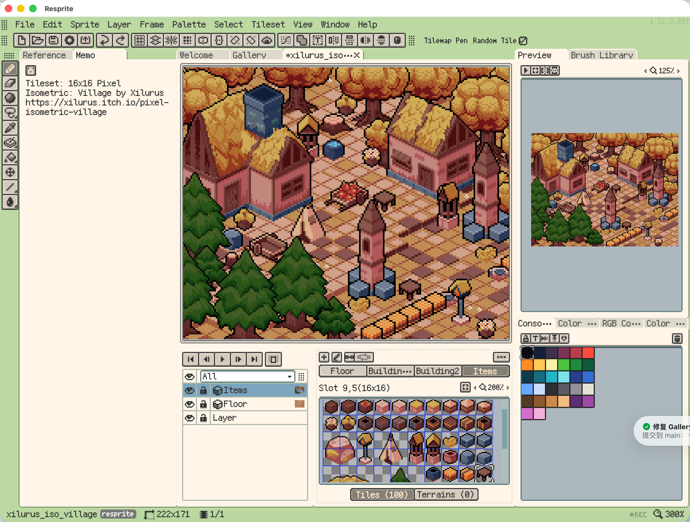

# Isometric Village Tilemap

A tiny isometric pixel world built with **Tilemap Layers** in Resprite.

## Preview

## Project Files

- [Resprite project](xilurus_iso_village.resprite) — Open in Resprite to explore the tilemap layers.

## Learn More

- [Official documentation: Tilesets and Tilemaps](https://resprite.fengeon.com/docs/drawing/tilemaps-and-tilesets)
- [Watch this example on YouTube](https://www.youtube.com/watch?v=ZrTWsm9cTrw)

## Credits

Tileset: [16x16 Pixel Isometric: Village](https://xilurus.itch.io/pixel-isometric-village) by **Xilurus**.
